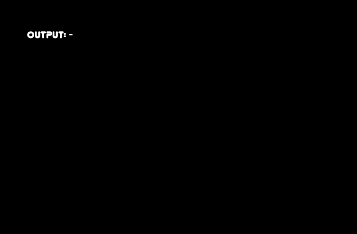
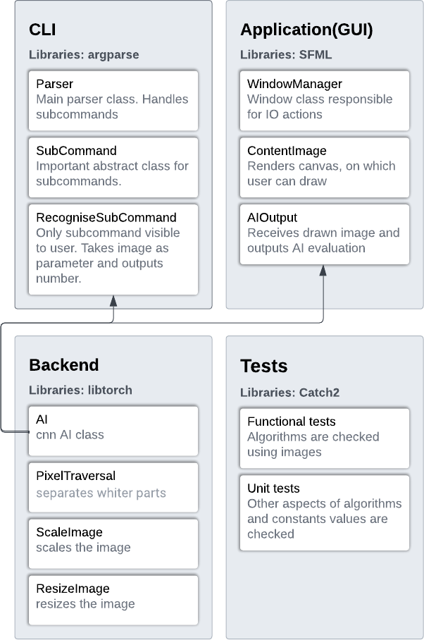

# MathDraw
The program is designed to calculate hand-drawn calculations. <br>
### Table of contents:
- [How to use](#how-to-use)
- [Specification](#specification)
- [Building and running](#building-and-running)

## How to use
When you run MathDrawApp, you will see empty black window with some text on it.<br>
This is your canvas on which you can draw.<br>
<br>
When you draw digits, the displayed text will tell you the detected number (from right to left, height doesn't matter).<br>
<br>

### Here are all actions that you can do:
#### mouse:
 - left mouse button - draw
 - right mouse button - erase
 - middle mouse button - erase whole white fragment
 
 #### keyboard:
 - W - move up
 - S - move down
 - A - move left
 - D - move right
 - Q - zoom in
 - E - zoom out
 <br>
 - ctr + E - clear everything

## CLI
MathDraw also provides CLI. <br>
There is one main command you would want to use:
It recognises the digits on given image and prints them.
```bash
MathDraw recognise
```
It has 3 arguments:
	- -i --image <path to image> - path to image to recognise, required
	- -m --model <path to model> - path to model to use, "<path to MathDraw.exe>\model.pt" by default
	- -n --number_system <number system> - number system to use, 10 by default

There are also hidden commands available for testing purposes.
For more information please refer to documentation.

## Specification
### Platform:
 - Windows 64 bit is required
### C++ standard
 - CPP 20
### Third party libraries:
- libTorch 2.0.1 - https://pytorch.org
- SFML - https://github.com/SFML/SFML.git
- ArgParse - https://github.com/p-ranav/argparse.git
- Catch2 - https://github.com/catchorg/Catch2.git
### Documentation
It features class and their members descriptions and also a tutorial. It can be found by going to doc/html/index.html

### Project scheme:


## Building and running
### Build:
Due to 64bit architecture it is strongly recommended to choose viusal studio generation method.
```bash
git clone https://github.com/jakubbaldyga/MathDraw.git
cd MathDraw

# Build
mkdir build
cd build
cmake .. -G "Visual Studio 17 2022" #or any other version
```
Open **MathDraw.sln** and build the projects(or select one, MathdrawApp project is recommended). <br><br>
### Run:
After succesful build, you should copy font(font.ttf) and model(model.pt) files from the res folder and paste them to build/(Release or Debug) next to the executables.<br><br>
There might be a need to copy there all dll's under **build/_deps/libtorch-src/lib** to **build/(Release or Debug)**, because libtorch is linked dynamically in this project.
<br><br>
By now you should have succesfully build and prepared the project.

## Troubleshoot
If at any point, any error occured, feel free to share in the issues tab.
