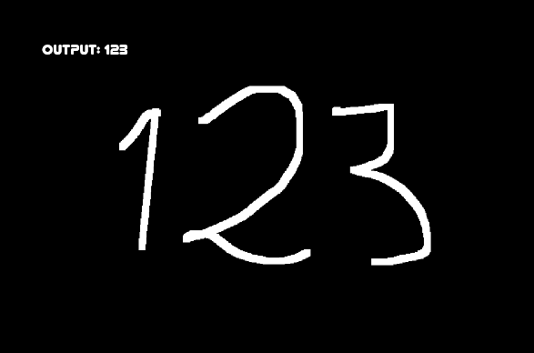

@page app MathDraw Application

###This tutorial will show you how to use MathDraw application.

When you run MathDrawApp, you will see empty black window with some text on it.
This is your canvas on which you can draw.

When you draw digits, the displayed text will tell you the detected number (from right to left, height doesn't matter).

###Here are all actions that you can do:

mouse:
 - left mouse button - draw
 - right mouse button - erase
 - middle mouse button - erase whole white fragment
 
 keyboard:
 - W - move up
 - S - move down
 - A - move left
 - D - move right
 - Q - zoom in
 - E - zoom out
  
 - ctr + E - clear everything